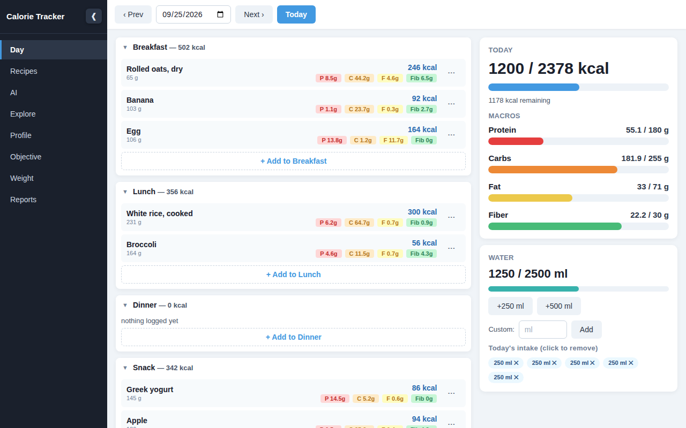
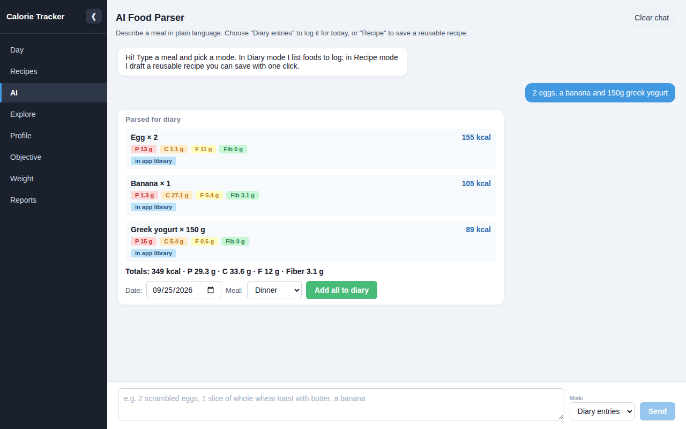
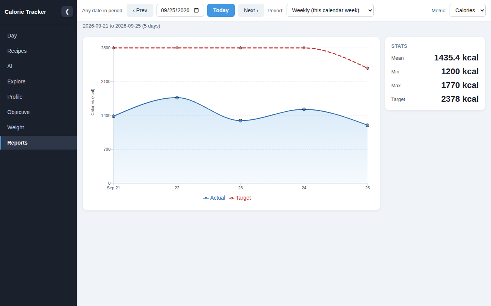
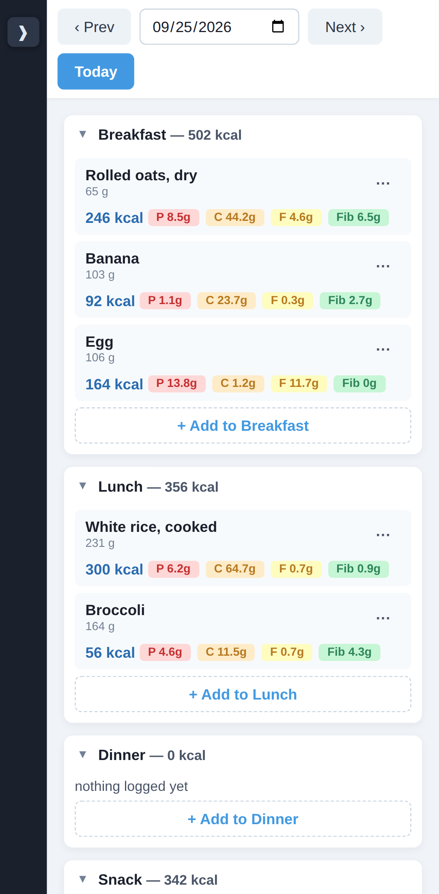

# Calorie Tracker

Log meals, water and weight, set a goal, and see daily and weekly progress.
It comes with a web app (the main client) and a JavaFX desktop app with the
same features. Both talk to Spring Boot microservices that run locally with
Docker Compose or on AWS.



| AI meal parser | Reports | Phone |
|---|---|---|
|  |  |  |

## Features

- **Diary:** four meals per day. Entries can be moved, copied or deleted,
  with calories, protein, carbs, fat and fiber totals against your targets.
  Water is tracked separately.
- **Foods and recipes:** about 160 built-in foods plus your own. Search
  tolerates typos. Recipes record the cooked weight, so portions are weighed
  after cooking.
- **AI parser:** type "2 eggs and a banana" and get the foods with their
  macros, ready to add to the diary or save as a recipe. It uses the built-in
  food library by default, or Google Gemini if you give it a key.
- **Goals:** targets come from your BMR and TDEE (Mifflin-St Jeor) and a
  lose/maintain/gain goal. Macros come from a preset. See
  [Nutrition rules](#nutrition-rules).
- **Weight log, reports and explore:** weekly and monthly charts with your
  past targets, food comparisons, and search by nutrition rules.
- **Accounts:** sign-up with email confirmation, password reset and account
  deletion. Sign-in uses SRP, so the password never leaves the device.

## How it works

```
 browser ─┐  HTTPS   CloudFront ──▶ private load balancer ─┬─ /api/* ─▶ api-gateway ─┬─▶ backend-core ─▶ PostgreSQL
 desktop ─┘                                                │                        └─▶ ai-service ──▶ Gemini (optional)
                                                           └─ else ──▶ web-client (nginx)
            sign-in: Cognito        service discovery: 2 Eureka servers
```

| Service | Does |
|---|---|
| `api-gateway` | Single entry for `/api`. Checks every token, routes to the services, adds security headers. |
| `backend-core` | All data: profile, goals, diary, foods, recipes, water, weight, reports, the AI quota. |
| `ai-service` | Turns meal text into nutrition (food-library search or Gemini). No database. |
| `eureka-server` | Service registry. Two replicating servers on AWS, one locally. |
| `web-client` | React app served by nginx. |
| `desktop-client` | JavaFX app using the same API. |

**Tech:** Java 21, Spring Boot 4, Spring Cloud 2025.1, PostgreSQL 16, Flyway,
React 19 + TypeScript + Vite, JavaFX 23, Docker, AWS (CloudFormation, ECS
Fargate, RDS, Cognito, CloudFront).

## Run it locally

Only Docker is needed. The desktop client also needs JDK 21+ and Maven.

```bash
make up        # builds and starts everything (~3 min the first time)
```

Open **http://localhost:8088**. Locally there's no sign-in: everything
belongs to one local user, and the data stays in a Docker volume.

| Command | |
|---|---|
| `make down` | stop (keeps the data) |
| `make logs` / `make ps` | follow logs / container health |
| `make desktop` | desktop client against the local app |
| `make test` | all 199 unit and integration tests, in Docker |
| `make e2e` | browser tests (12) against the running app |

Every port is bound to `127.0.0.1`. For hot reload on the web app (Node 20+):
`cd web-client && npm install && npm run dev`, then open http://localhost:5173.

### Settings

Copy [.envrc.example](.envrc.example) to `.envrc` (gitignored) and set only
what you need. Most users need just `GEMINI_API_KEY` for AI with Gemini, and
`AWS_DEFAULT_REGION` for the cloud. The example lists every setting with its
default. Anything you leave out uses that default.

## Deploy to AWS

You need the AWS CLI (`aws configure`) and Docker.

```bash
make deploy       # ~45 min the first time; prints https://<id>.cloudfront.net
make smoke        # 30 checks against the live app, ~1 min
make destroy      # deletes everything; charges stop
```

`make deploy` creates five CloudFormation stacks:

| Stack | Contents |
|---|---|
| network | VPC, subnets, Cloud Map, image registries |
| database | encrypted RDS PostgreSQL |
| Cognito | user pool |
| app | ECS Fargate services with auto scaling, private load balancer, CloudFront with HTTPS on a free `*.cloudfront.net` address |
| CI/CD (optional) | the pipeline from GitHub |

It is safe to re-run. Other commands:

| Command | |
|---|---|
| `make deploy-app` | apply a changed setting or `04-app.yaml` |
| `make deploy-images SERVICES="backend-core"` | ship code without CI (all images if `SERVICES` is omitted) |
| `make desktop-cloud` | desktop client against the deployment |
| `make cloud-status` | which stacks exist, i.e. what is costing money |

A custom domain is optional: set `DOMAIN_NAME` and `CLOUDFRONT_CERT_ARN` (an
ACM certificate in `us-east-1`).

### Cost

About **$0.20/hour** in eu-central-1, billed hourly with nothing monthly.

| Item | Per hour |
|---|---|
| 6 Fargate tasks + their public IPs | $0.12 |
| Load balancer | $0.035 |
| PostgreSQL `db.t4g.micro` | $0.023 |
| Logs, secrets, alarms, images | ~$0.02 |

CloudFront, Cognito (under 10k users) and the library AI are free.

- **Auto scaling:** adds about $0.02/h per extra task, only under load.
- **WAF (optional):** +$0.011/h.
- **Each CI run:** about $0.35.
- **A 5-hour test:** deploy, test and destroy costs about $1.20.
- **Leaving it running:** about $4.80/day. `BUDGET_EMAIL` sends a free cost
  alert.

### CI/CD (optional)

Every push to `main` runs the full test suite and the browser tests, pushes
the images, rolls the services and runs the smoke test. Nothing deploys if a
test fails, and documentation-only commits are skipped. Steps:
[infra/buildspec.yml](infra/buildspec.yml).

To enable it:
1. Create a GitHub connection in the AWS console: *Developer Tools* →
   *Settings* → *Connections*.
2. Set `GH_CONN_ARN` and `GH_REPO` in `.envrc`.
3. Commit and push.
4. Run `make deploy`. It won't create the pipeline while local changes are
   unpushed, because the pipeline's first run deploys what's on GitHub.

## Nutrition rules

- **Calorie target:** TDEE adjusted by the goal percentage, but **never below
  your BMR**. Cuts that would go below it can't be picked.
- **Protein cap:** protein is capped at **2.2 g per kg** of body weight. The
  calories above the cap go to carbs and fat, so the total stays the same.
- **Where the rules live:** backend-core's `NutritionCalculator`. The web and
  desktop previews use copies of it, and the same test numbers check all three.

## Security

- **Transport:** HTTPS only (CloudFront). Browsers below TLS 1.2 are refused.
  The load balancer and database are in private subnets, and the database
  connection uses verified TLS.
- **Tokens:** the gateway and each service check every token: signature,
  expiry, issuer, access token only, and this app's client only.
- **Data isolation:** every query is limited to the signed-in user.
- **Browser:** one origin, so there is no CORS. Strict CSP and security
  headers.
- **Sessions:** 1-hour access tokens with silent refresh. Sign-out revokes the
  refresh token. The web app keeps the refresh token in memory; the desktop
  app stores its session in an owner-only file.
- **Limits:** per-user AI quota (10/min, 200/day, counted in the database),
  request size limits, optional WAF.
- **Containers:** non-root, no AWS permissions. Secrets live in AWS Secrets
  Manager.

Known limits: no MFA (by choice). The AI quota uses fixed windows, so a short
burst across a minute boundary can reach twice the per-minute limit.

## Tests

| Suite | Count |
|---|---|
| backend-core (over HTTP, real PostgreSQL via Testcontainers) | 62 |
| ai-service | 51 |
| desktop-client | 29 |
| api-gateway | 11 |
| web-client (Vitest) | 46 |
| Browser journeys (Playwright, desktop + phone) | 12 |
| Live smoke test after deploying | 30 checks |

The SRP sign-in code in both clients is checked against values from AWS's own
`amazon-cognito-identity-js`.

## Repository layout

| Path | |
|---|---|
| `api-gateway/`, `backend-core/`, `ai-service/`, `eureka-server/` | Spring Boot services |
| `web-client/` | React app ([README](web-client/README.md)) |
| `desktop-client/` | JavaFX app (`make package-desktop` builds a native app) |
| `infra/cloudformation/` | 01 network · 02 database · 03 Cognito · 04 app · 05 CI/CD |
| `scripts/` | `deploy.sh`, `destroy.sh`, `smoke-test.sh`, `test-all.sh`, `package-desktop.sh` (settings in `vars.sh`) |
| `docker-compose.yml`, `Makefile` | local stack, commands |
